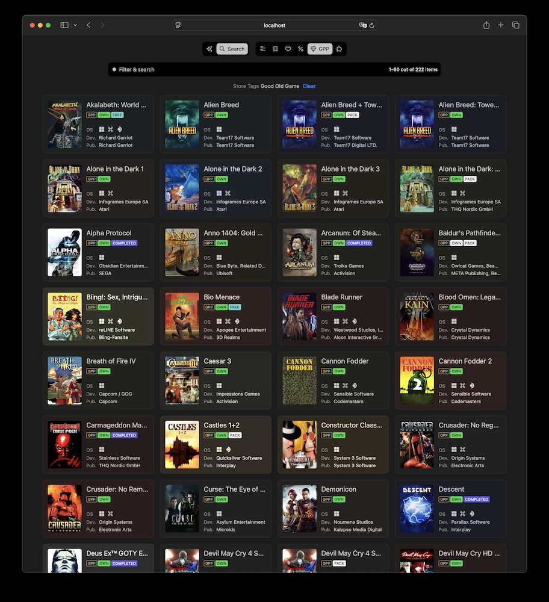
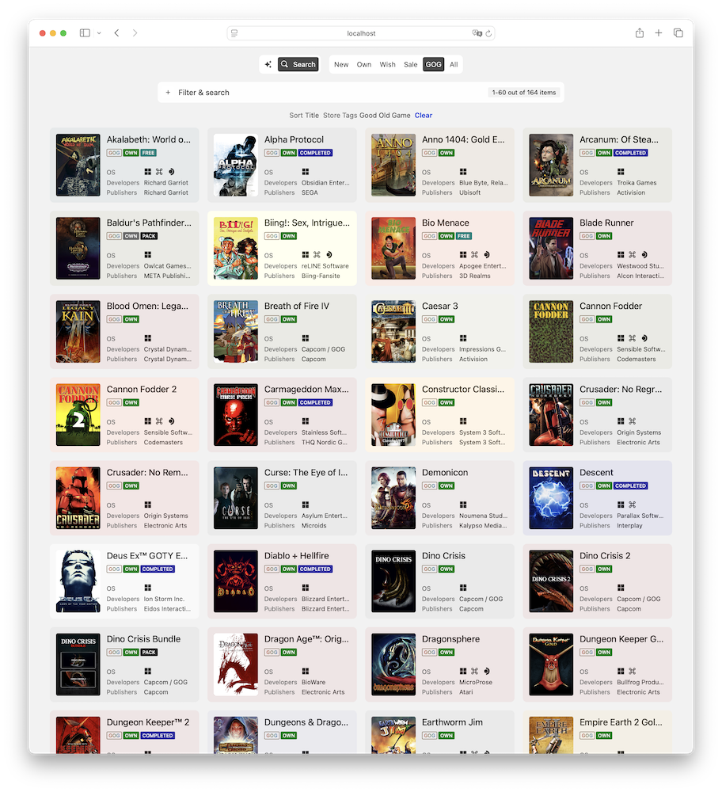
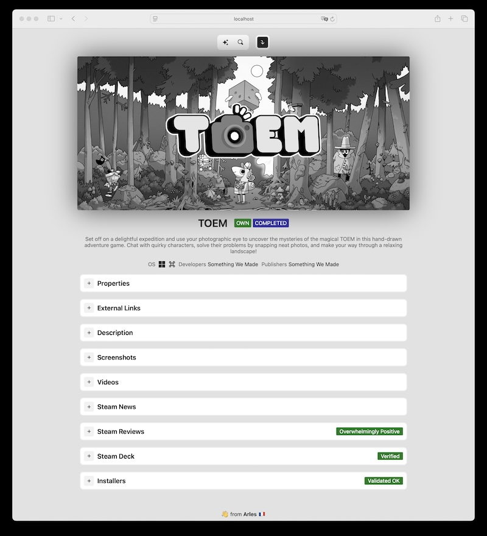

# vangogh

`vangogh` helps you create and manage a personal, DRM-free library of your GOG game collection. It works alongside `theo`(https://github.com/arelate/theo) to simplify downloading, installing and playing games on your devices.

| Dark theme                                       | Light theme                                        |
|--------------------------------------------------|----------------------------------------------------|
|        |        |
|  |  |

## Installation

Check out [Installation with docker](https://github.com/arelate/vangogh/wiki/Installation-with-docker).

## User management

Check out [Authorization and user management](https://github.com/arelate/vangogh/wiki/Authorization-and-user-management).

## Browser compatibility

Something not looking right? Check out [Browser compatibility](https://github.com/arelate/vangogh/wiki/Browser-compatibility)

## Setting up GOG.com authorization with cookies.txt

After you've installed `vangogh`, you need to authenticate GOG.com access by providing browser cookie data. 

To do that you need to create `cookies.txt` in the `input` folder (see [docker installation](#Installation) - by default that's the `vangogh` application data root folder where all other subfolders like `metadata` are located), then follow [instructions here](https://github.com/boggydigital/coost#copying-session-cookies-from-an-existing-browser-session) to copy GOG.com request cookies into that file.

As a result, the content of `cookies.txt` should look like this:

```text
gog.com
 cookie-header=paste copied GOG.com request headers here
```

If you want to de-authorize `vangogh` from accessing your remote GOG.com data - delete the `cookies.txt` file. All the account specific data you'll have accumulated until that point will be preserved in `vangogh`.

## Updating data

To update your data you can use `vangogh` with a CLI interface to get and maintain all the publicly available GOG.com data, including your account data (game installers):

- in the same folder with `compose.yml` config use `docker compose exec vangogh vangogh <command> <options>`
- most commonly you would run sync `docker compose exec vangogh vangogh sync -all` that gets all available data from GOG.com. 

Sync is optimized to get as little data as possible on each run - only the newly added images and updated installers. There is no great way to determine if metadata was updated remotely, so all of it is fetched on each sync - however upon doing that `vangogh` would know exactly what changed and use this information to optimize decisions. You can also create scheduled runs of synchronization (e.g. with cron) to keep your data fresh. We recommend running sync no more often than every 24 hours. 

### Disk space requirements

Please note that all data === a lot of data, so make sure you have space available for `-all` or use specific options to get what you need (any combination of `-description-images -images -screenshots -videos-metadata -downloads-updates`)

Here are few estimates of how much space you'll need for each type of data:

- metadata (GOG, Steam, PCGamingWiki, HLTB, ProtonDB data for GOG products): 1Gb
- images, including screenshots: 68Gb
- description items: 19Gb
- product installers estimates (done with `size` command): 
  - 6.5Tb/1000 products for all operating systems (Windows, macOS, Linux) for the 10 most common languages installers, DLCs, extras
  - 4.5Tb/1000 products for all operating systems (Windows, macOS, Linux), English installers, DLCs, extras 
  - 3.3Tb/1000 products for Windows, English installers, DLCs, extras
  - 1.0Tb/1000 products for macOS, English installers, DLCs, extras
  - 0.6Tb/1000 products for Linux, English installers, DLCs, extras

`vangogh` directories allow you to use the best storage type for each data type. For example you might want to store installers, checksums and logs on slower HDDs as those are typically written and read sequentially. Metadata and images on the other hand would benefit from faster SSDs if you're using `vangogh` as a web frontend for your data.

## Downloads layouts

`vangogh` supports two ways product directories will be created in the downloads directory:
- `flat`, the default behavior. If you don't specify downloads layout - you'll get this layout. In this layout product directories will be placed as-is in the downloads directory. For example for a product with a slug "abc", you'll get "{downloads directory}/abc". This is the default layout used by some other GOG downloads tools and might allow easier integrations. Please note that you might start experiencing performance issues with larger libraries, proceed with caution!
- `sharded`. Product directories will be placed in a first-letter parent directory under downloads directory. For example for a product with a slug "abc", you'll get "{downloads directory}/a/abc". This is done to minimize the impact of large number of child objects in a directory that might impact certain filesystems.

In order to change download layouts please use the following steps:
- backup local data (run `backup` on your `vangogh` instance)
- run `relayout-downloads -from {from} -to {to}`, where {from}, {to} are either `flat` or `sharded` depending on your needs
- specify `VANGOGH_DOWNLOADS-LAYOUT={new-layout}` in the `compose.yml` (see the example [above](#Installation))
- recreate the container and restart `vangogh`

## Taking care of your data

Syncing data keeps it in sync with GOG.com. As part of this process some data is left on the system and `vangogh` provides few ways to clean up and vet the data:

- `cleanup` will take care of older downloads versions. `cleanup -all -test` will enumerate all installers that are not linked to most current data. `cleanup -all` (without `-test`) will delete that data.
- `vet` will take care of various data problems, such as local-only images, old logs, etc. `vet -all` will run series of tests of data and print out recommendations. `vet -all -fix` will also attempt to repair the problem.
- `validate` will test installers you've downloaded using validation files provided by GOG.com. `validate -all-not-valid` will do that for all installers that are not in valid state. Please note that GOG.com is missing validation files for some installers and this will not be considered a critical error - you can use `vet` to generate missing checksums (by computing them locally - won't validate data validity, but will help maintain data consistency over time). 

## vangogh and GOG.com games sharing guidelines

`vangogh` assumes you follow GOG.com [games sharing guidelines](https://support.gog.com/hc/en-us/articles/212184489-Can-I-share-games-with-others-?product=gog). Just like GOG.com, we trust you that this will not be abused.
